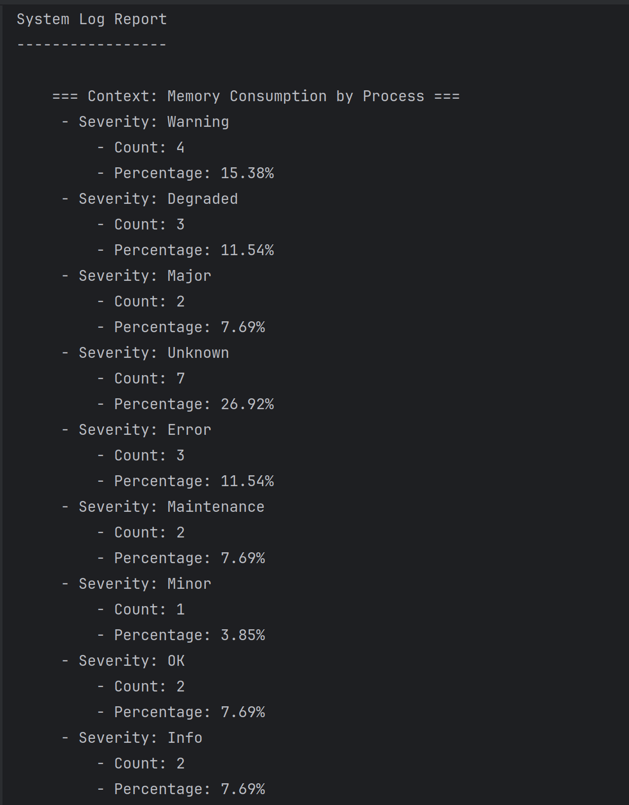

# Log File Processing Tool Project

## Overview

This project implements a robust real-time log stream analysis system using a producer-consumer architecture, leveraging Apache Kafka and MongoDB. It's designed to handle and process diverse log data from multiple channels, providing insightful analytics and report.
For detailed information about the application architecture, please refer to the "Architecture & Components" section at the end of this documentation.

## Features

- **Streaming Real-time Data:**
    - Simulates log production from different channels: Application, UserActivity, and System.
    - Generates different log messages in various contexts with severity levels.

- **Advanced Pattern Matching:**
    - Processes log data using advanced pattern matching techniques.

- **Input Validation:**
    - Provides input validation for application configuration via the command prompt.

- **Filter Logs by Date Interval:**
    - Allows users to filter logs based on a specified date interval.

- **Log Reporting and Summary:**
    - Generates log reports and summaries.
    - Detailed reports group logs by context and severity levels for each context.

- **Write Logs to File:**
    - Writes logs to output files.
    - Supports filtering logs by date.

- **Unit Tests:**
    - Includes unit tests to ensure functionality and reliability.

## Setup and Running Instructions

Follow these steps to set up and run the Log File Processing Tool:

1. Clone the project from GitHub: [GitHub Repository Link](xxxx)

2. Set up Kafka on your computer. You can find installation instructions [here](https://www.digitalocean.com/community/tutorials/how-to-install-apache-kafka-on-ubuntu-20-04).

3. Set up MongoDB on your computer. You can find installation instructions[here](https://hevodata.com/learn/mongodb-java).

4. Run the `LogFileProcessorTool.java` file to start the log processing.

## Running the Application Steps

To run the Log File Processing Tool application, follow these steps:

1. Navigate to the producer directory:

```bash
cd src/main/java/LogFileProcessorToolApp/producer/
````

2. Run the `LogProducerApp.java` file.

3. Next, navigate to the consumer directory:

```bash
cd src/main/java/LogFileProcessorToolApp/consumer/
````

4. Run the `LogProcessingConsumer.java` file.
You will see streaming logs on terminal after consumer is started. 

5. Finally, return to the project's root directory:

```bash
cd src/main/java/LogFileProcessorToolApp/
````
6. Run the `LogFileProcessorTool.java` file.

7. The summary will be printed in the terminal, as seen in the provided images.

8. Additionally, you can find the output in the log folder.

For detailed setup instructions and usage guidelines, please refer to the [documentation](link-to-documentation).

## Directory Structure

```plaintext 
├── src
│   ├── main
│   │   ├── java
│   │   │   └── LogFileProcessorToolApp
│   │   │       ├── adapter
│   │   │       │   └── MongoDBManager.java
│   │   │       ├── consumer
│   │   │       │   └── LogProcessingConsumer.java
│   │   │       ├── generator
│   │   │       │   ├── ApplicationLogGenerator.java
│   │   │       │   ├── SystemLogGenerator.java
│   │   │       │   └── UserActivityLogGenerator.java
│   │   │       ├── LogFileProcessorTool.java
│   │   │       ├── matcher
│   │   │       │   └── LogPatternMatcher.java
│   │   │       ├── processor
│   │   │       │   ├── ApplicationLogProcessor.java
│   │   │       │   ├── LogProcessor.java
│   │   │       │   ├── PerformanceLogProcessor.java
│   │   │       │   └── SystemHealthLogProcessor.java
│   │   │       ├── producer
│   │   │       │   ├── LogProducerApp.java
│   │   │       │   └── LogProducer.java
│   │   │       ├── service
│   │   │       │   └── LogService.java
│   │   │       ├── strategy
│   │   │       │   └── LogGenerationStrategy.java
│   │   │       └── util
│   │   │           └── DateParser.java

```
## Sample Outputs





## Architecture & Components
1. **Producers (3 Units)**
  - **Channels:**
    - **UserActivity:** Captures user interactions within the application.
    - **Application:** Gathers application-generated error and warning messages.
    - **System:** Monitors and logs system performance metrics (CPU, memory, network).
  - **Technology:** Utilizes Kafka's efficient data streaming capabilities for real-time data transmission.

2. **Consumer (1 Unit)**
  - **Function:** Receives data from all producers and stores it in MongoDB.
  - **MongoDB Integration:** Chosen for its flexibility in handling various data formats and ease of scaling.

3. **LogFileProcessorTool**
  - **Purpose:** Processes and analyzes log data stored by the consumer.
  - **Functionality:**
    - **Pattern Matching:** Classifies and segregates messages into respective channels.
    - **Data Parsing & Aggregation:** Organizes log messages by severity, context, and type.

### Data Processing & Reporting
1. **Application Logs:**
  - **Analytics:** Counts of error and warning messages.
  - **Report:** Detailed breakdown and visualization of application health and stability indicators.

2. **System Logs:**
  - **Context Grouping:** System logs are categorized by context.
  - **Severity Analysis:** Counts and percentages of each severity level within contexts.

3. **User Activity Logs:**
  - **User Interaction Tracking:** Lists visited pages and user interactions with various components.
  - **Engagement Metrics:** Provides insights into user behavior and application usability.

### Technologies and Tools
- **Apache Kafka:** Manages real-time data streaming, ensuring efficient and reliable transmission of log data from producers to the consumer.
- **MongoDB:** Offers a scalable and flexible database solution, ideal for storing varied log data formats.

### Key Benefits
- **Real-Time Analysis:** Enables immediate insights into user behavior, system performance, and application health.
- **Comprehensive Reporting:** Facilitates data-driven decision-making with detailed and categorized log reports.

## Author

Irem Zeynep Dundar, dundariremzeynep@gmail.com.
S